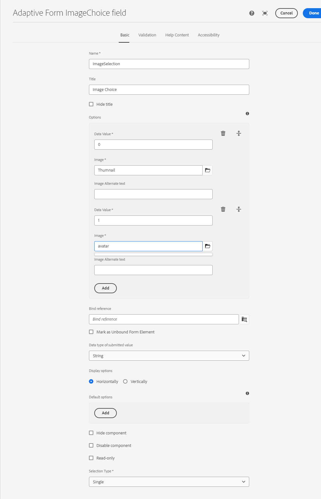
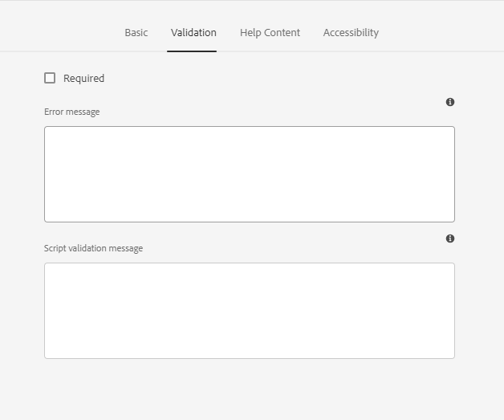

# アダプティブフォーム ImageChoice フィールド {#image-choice}

フォームの画像選択コンポーネントでは、テキストベースのオプションではなく、画像などの視覚的表現に基づいて選択できます。 一連の画像が表示され、それぞれ明確な選択肢を表します。 ユーザーは1つ以上の画像を選択でき、選択を示す視覚的なフィードバックが表示されます。 このコンポーネントは、製品のバリエーション、アンケートの回答、プロファイル画像などのオプションで便利です。 直感的で視覚的にわかりやすい選択方法を提供することで、ユーザーのエンゲージメントと明瞭性を高めます。

## 使用方法

画像選択コンポーネントの主な機能には、次のようなものがあります。

- **画像の表示域：**&#x200B;従来のテキストラベルまたはラジオボタンの代わりに画像が表示されます。 各画像は、選択できる選択肢に対応し、使用可能なオプションを視覚的に表現します。

- **クリック可能な画像：** ユーザーは、画像を直接クリックしてオプションを選択できます。 選択した画像は、選択されたことを示すためにハイライト表示されることがよくあります。

- **単一または複数の選択：** コンポーネントのデザインに応じて、ユーザーは1つの画像または複数の画像を選択できます。

## バージョンと互換性 {#version-and-compatibility}

アダプティブ Formsの画像選択コンポーネントは、コアコンポーネント 2.0.64の一部としてリリースされました。 次の表に、サポートされているすべてのバージョン、AEM の互換性、対応するドキュメントへのリンクを示します。

| コンポーネントのバージョン | AEM as a Cloud Service |
|---|---|
| v1 |  [リリース 2.0.64](/help/adaptive-forms/version.md) 以降と互換性あり |

コアコンポーネントのバージョンとリリースについて詳しくは、[コアコンポーネントのバージョン](/help/adaptive-forms/version.md)ドキュメントをご覧ください。

## 技術的詳細 {#technical-details}

アダプティブ Forms Image Choice コアコンポーネントの最新情報については、[GitHub](https://github.com/adobe/aem-core-forms-components/tree/master/ui.af.apps/src/main/content/jcr_root/apps/core/fd/components/form/)のテクニカルドキュメントをご覧ください。 コアコンポーネントの開発について詳しくは、[コアコンポーネント開発者向けドキュメント](/help/developing/overview.md)をご覧ください。

## 設定ダイアログ {#configure-dialog}

設定ダイアログを使用すると、訪問者向けに画像選択コンポーネントエクスペリエンスを簡単にカスタマイズできます。

### 「基本」タブ {#basic-tab}

- **名前** - フォームコンポーネントは、フォーム内とルールエディター内の両方で一意の名前で簡単に識別できますが、名前にスペースや特殊文字を含めることはできません。

- **タイトル** - タイトルを使用すると、アダプティブフォーム内のコンポーネントタイプを簡単に識別できます。デフォルトでは、タイトルはコンポーネントの横に表示されます。

- **タイトルを非表示** - 「タイトルを非表示」ボックスをオンにすると、タイトルを非表示にできます。

- **オプション** – 単一または複数の画像を追加し、画像選択プロパティをカスタマイズするのに役立ちます。 画像選択プロパティには、各画像のデータ値、画像参照アセット、代替テキストが含まれます。

- **バインド参照** - バインド参照は、外部データソースに保存され、フォーム内で使用されるデータ要素への参照です。 バインド参照を使用すると、データをフォームフィールドに動的にバインドして、フォームにデータソースの最新のデータを表示できます。

  例えば、フォームに入力された顧客 ID に基づいて、顧客の名前と住所をフォームに表示できます。 さらに、フォームに入力されたデータでデータソースを更新することもできます。 このように AEM Formsで外部データソースとやり取りするフォームを作成して、データの収集と管理のためのシームレスなユーザーエクスペリエンスを提供できます。

- **非連結フォーム要素としてマーク**：どのスキーマにもリンクされていないフォームフィールドを設定する場合は、このオプションを選択します。 このオプションを使用すると、データソースを更新せずにデータを保存できます。 また、標準のデータベース統合とは別に、カスタム方法でデータを処理できます。

- **送信された値のデータタイプ**：このオプションでは、いずれかのオプションが選択された場合に送信される値のデータタイプを指定します。 「**送信された値のデータタイプ**」が「`Number`」に設定されている場合に、「**オプション**」タブの「**データ値**」に文字列データを追加すると、画面に `Value type mismatch` エラーメッセージが表示されます。

- **表示オプション**：画像の選択フィールドを水平方向または垂直方向に表示するオプションが表示されます。

- **デフォルト値**：このオプションを使用すると、フォームフィールドにデフォルト値（データ値）を追加できます。 **無効なコンポーネント**&#x200B;または&#x200B;**読み取り専用コンポーネント**&#x200B;が選択されている場合、デフォルト値が画面に表示されます。 ユーザーがフォームフィールドに値を入力しない場合、この値はフォーム送信時に送信されます。

- **コンポーネントを非表示**: フォームからコンポーネントを非表示にするオプションを選択します。 このコンポーネントは、他の目的（ルールエディターでの計算に使用するなど）にも利用できます。 これは、ユーザーが表示する必要のない情報や直接変更した情報を保存する必要がある場合に役立ちます。

- **コンポーネントを無効にする**: コンポーネントを無効にするかロックするオプションを選択します。 エンドユーザーは、無効になっているコンポーネントをアクティブにしたり、編集したりすることはできません。 ユーザーはフィールドの値を表示できますが、変更することはできません。 このコンポーネントは、他の目的（ルールエディターでの計算に使用するなど）にも利用できます。

- **読み取り専用**：このオプションを使用すると、フォームフィールドにデフォルト値（データ値）を追加できます。 **無効なコンポーネント**&#x200B;または&#x200B;**読み取り専用コンポーネント**&#x200B;が選択されている場合、デフォルト値が画面に表示されます。 ユーザーがフォームフィールドに値を入力しない場合、この値はフォーム送信時に送信されます。

- **選択タイプ**：このオプションを使用すると、ユーザーは画像の選択フィールドを1つまたは複数の選択できます。

### 「検証」タブ {#validation-tab}

- **必須** - コンポーネントをアダプティブフォームに表示する場合は、このオプションを選択します。 オプションを選択した後、フォームの送信を続行する前に選択を行う必要があります。 このオプションを選択した場合、「**基本**」タブで「**コンポーネントを非表示**」または「&lbrace; コンポーネントを無効にする**を選択することはできません。

- **エラーメッセージ** – このオプションを使用すると、**必須** チェックボックスがオンになっていて、画像選択フィールドが選択されていない場合に表示されるメッセージを入力できます。

- **スクリプト検証メッセージ** - スクリプトの検証が失敗した場合に表示するメッセージを入力できます。

### 「ヘルプコンテンツ」タブ {#helpcontent-tab}

- **短い説明** - 短い説明は、特定のフォームフィールドの目的に関する追加の情報や説明を提供する簡単な説明文です。 これにより、ユーザーは、フィールドに入力するデータの種類を理解しやすくなります。また、入力された情報が有効で目的の条件を満たしていることを確認できるように、ガイドラインや例を提供できます。 デフォルトでは、短い説明は非表示になっています。 「**短い説明を常に表示**」オプションを有効にすると、コンポーネントの下に説明が表示されます。

- **短い説明を常に表示** - このオプションを有効にすると、コンポーネントの下に短い説明が表示されます。

- **ヘルプテキスト** - ヘルプテキストとは、フォームフィールドの正しい入力を支援するためにユーザーに提供される追加の情報やガイダンスを指します。 コンポーネントの横に配置されているヘルプアイコン（i）をクリックすると表示されます。 ユーザーがフィールドの要件や制約を理解できるように設計されているヘルプテキストは、フォームフィールドのラベルやプレースホルダーテキストよりも詳細な情報を提供できます。 また、フォームへの入力をより簡単かつ正確にするための提案や例を提供することも可能です。

### 「アクセシビリティ」タブ {#accessibility-tab}

- **スクリーンリーダー用テキスト** - スクリーンリーダー用テキストとは、視覚に障がいのあるユーザーが使用する支援テクノロジー（スクリーンリーダー）によって読み上げられる追加のテキストを指します。 このテキストでは、フォームフィールドの目的に関するオーディオの説明が提供され、フィールドのタイトル、説明、名前および関連するメッセージ（カスタムテキスト）に関する情報を含めることができます。 スクリーンリーダー用のテキストを使用すると、視覚に障害のあるユーザーを含むすべてのユーザーがフォームに確実にアクセスして、フォームフィールドとその要件を完全に理解できるようになります。
   - **カスタムテキスト**：ARIA アクセシビリティラベルにカスタムテキストを使用する場合は、このオプションを選択します。 このオプションを選択すると、「カスタムテキスト」ダイアログボックスが表示されます。 関連情報は、「カスタムテキスト」ダイアログボックスで追加できます。
   - **タイトル**：ARIA アクセシビリティラベルのタイトルを使用する場合は、このオプションを選択します。

## 関連記事 {#related-articles}

{{more-like-this}}

## 関連トピック {#see-also}

{{see-also}}

